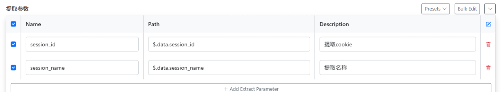
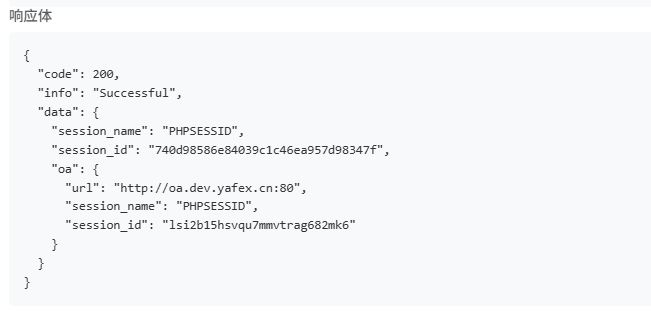
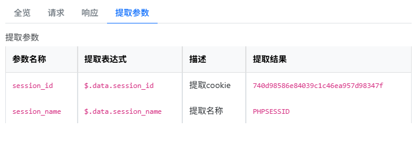
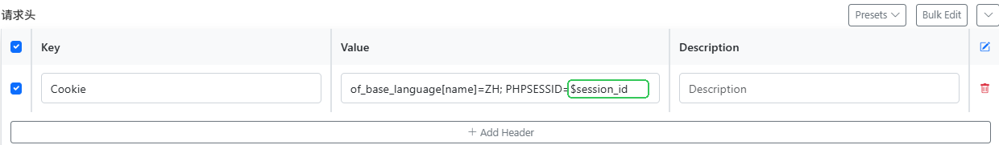
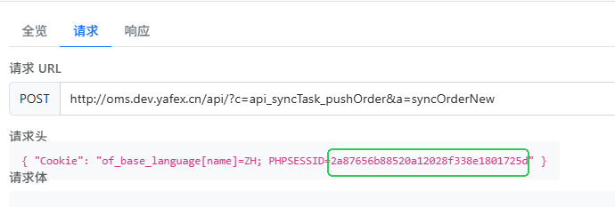

## EasyTesting操作手册

#### 1. 参数提取

测试用例中，如果请求返回了参数，那么可以在用例中提取参数，并保存到环境变量中，方便后续请求使用。

* *参数提取* : 使用 "$.提取参数路径" 表示提取参数, 例如：
   \`\`\`
   $.data.session_id
   \`\`\`
  
  
  

#### 2. 使用参数

在用例中，可以使用参数提取后的参数，用于上下游接口传递 参数。

* *使用参数* : 使用 "$提取参数名" 表示使用参数, 例如：
   \`\`\`
   of_base_language[name]=ZH; PHPSESSID=$session_id
   \`\`\`
   
   

#### 3. mock数据

测试用例中，可以使用mock数据，根据规则生成模拟数据。

* *mock数据* : 使用 "mock:{mock规则}"

*  为每个字段设计生成规则
 \`\`\`markdown
  string：随机英文字母、数字组合，可根据 length 指定长度
  integer：在 min/max 范围内随机生成
  float：指定精度随机生成
  email：生成格式化邮箱，如 nameXXXX@test.com
  datetime/date：随机生成日期时间
  enum/bool：随机选择或取 true/false
  ...

\`\`\`
  
* 示例：

\`\`\`python

[
{"name": "age", "type": "integer", "min": 18, "max": 60, "required": False},
{"name": "email", "type": "string", "format": "email", "required": True},
{"name": "address", "type": "address", "required": False},
{"name": "phone", "type": "phone", "required": False},
{"name": "url", "type": "url", "required": False},
{"name": "city", "type": "city", "required": False},
{"name": "job", "type": "job", "required": False},
{"name": "company", "type": "company", "required": False},
{"name": "username", "type": "username", "required": False},

]

\`\`\`

  
