# EasyTesting

使用Django、Django REST框架、SQLite、Bootstrap和HTTPRunner构建的综合测试平台，包含测试前台和后台管理后台，后台管理系统使用Django-SimpleUI构建。

## 推荐版本

- Django==4.2.11
- djangorestframework==3.15.2
- httprunner==4.3.0
- jsonpath-ng==1.7.0
- django-simpleui==2025.5.17
- Faker==37.3.0
- django-cors-headers==4.3.1
- requests==2.31.0
- Pillow==10.1.0
- celery==5.3.4
- redis==5.0.1
- croniter==2.0.1
- django-celery-beat==2.5.0
- django-cors-headers==4.3.1

## 功能特点

- 创建和管理测试项目
- 使用变量定义测试环境
- 使用请求详细信息和验证规则创建API测试用例
- 将测试用例组织到测试套件中
- 执行测试并查看结果
- 通过执行结果生成测试报告
- 用于与其他工具集成的RESTful API

## 快速开始

1. 拉取代码:

```
   git clone https://gitee.com/joyamon/easy-testing.git
```

2. 创建虚拟环境:
   ```
   python -m venv venv
   source venv/bin/activate 
   ```
3. 安装依赖:
   ```
   pip install -r requirements.txt
   ```
4. 生成迁移文件并迁移数据库:
   ```
   python manage.py makemigrations
   python manage.py migrate
   ```
5. 创建管理员:
   ```
   python manage.py createsuperuser
   ```
6. 启动服务器:
   ```
   python manage.py runserver
   ```
7. 启动celery和beat
   ```
   celery -A EasyTesting worker -l info
   celery -A EasyTesting beat -l info
   
   ```
## 使用

1. 点击 http://localhost:8000/ 访问
2. 使用账号密码登录
3. 创建项目、环境、测试用例和测试套件
4. 执行测试用例并查看结果

## 效果截图

### 注册

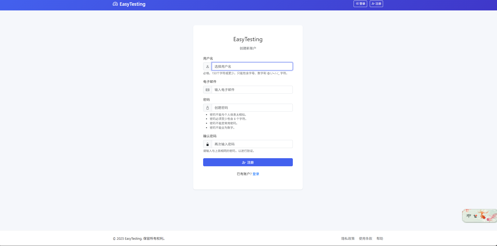

### 登录

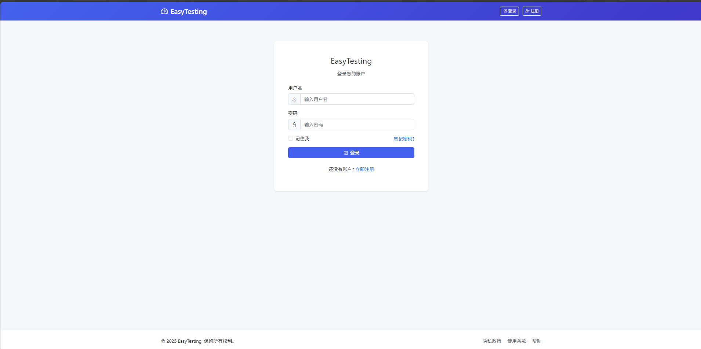

### 面板

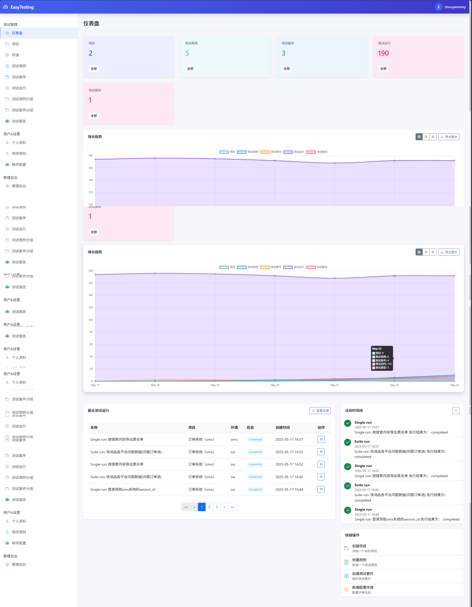

### 项目

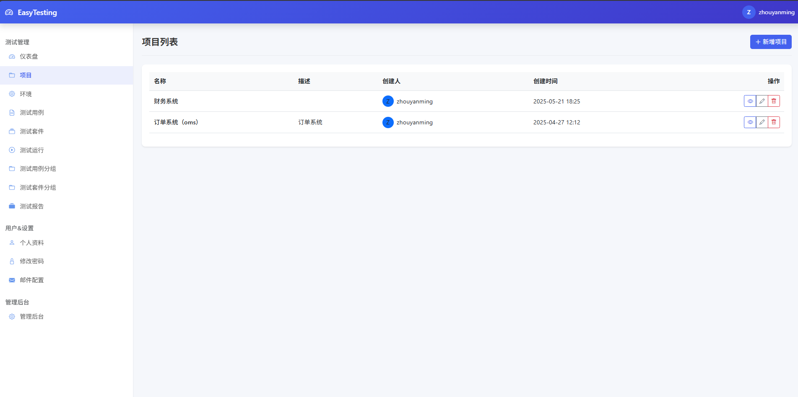

### 项目详情

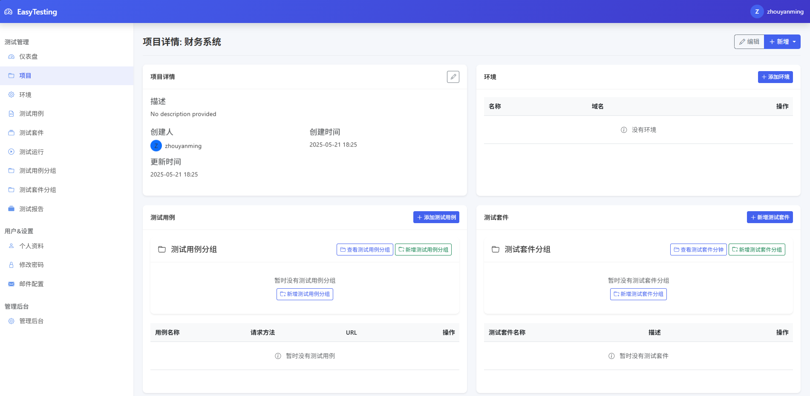

### 环境

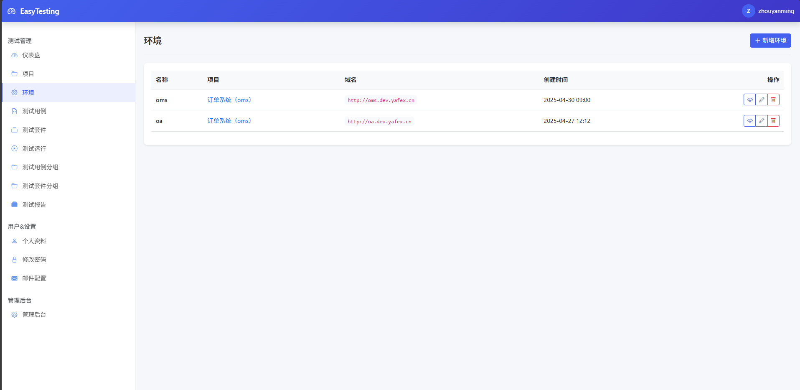

### 测试用例


### 测试用例详情

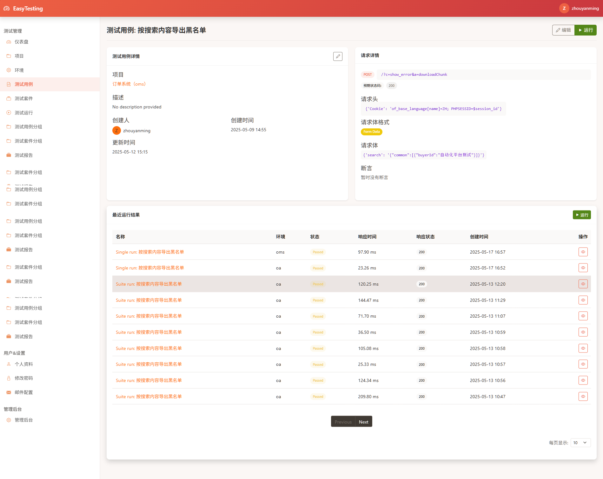

### 测试套件


### 测试套件详情

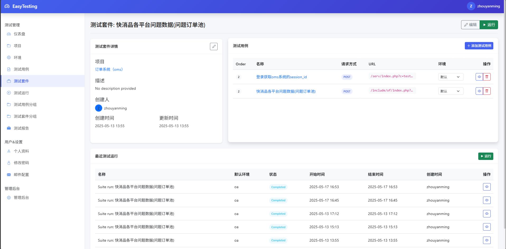

### 测试运行


### 测试结果

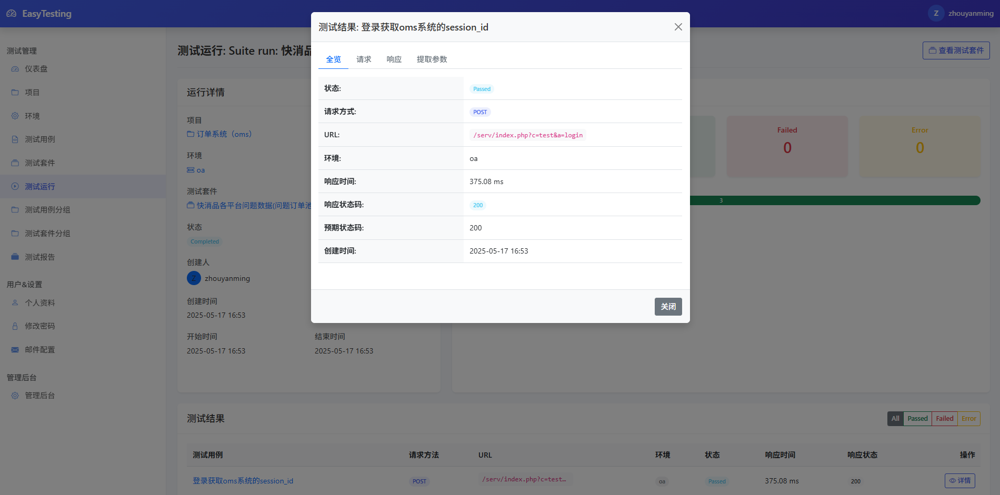

### 测试用例分组


### 测试套件分组


### 个人资料

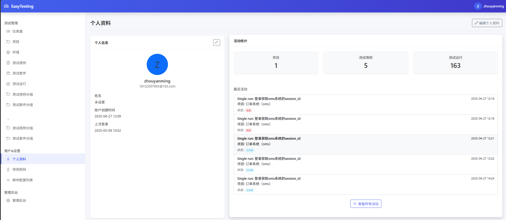

### 修改密码

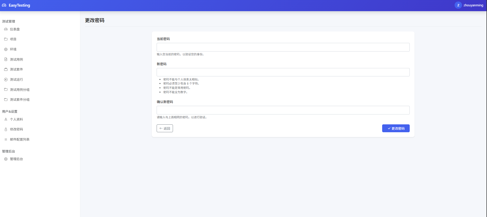

### 邮件配置列表

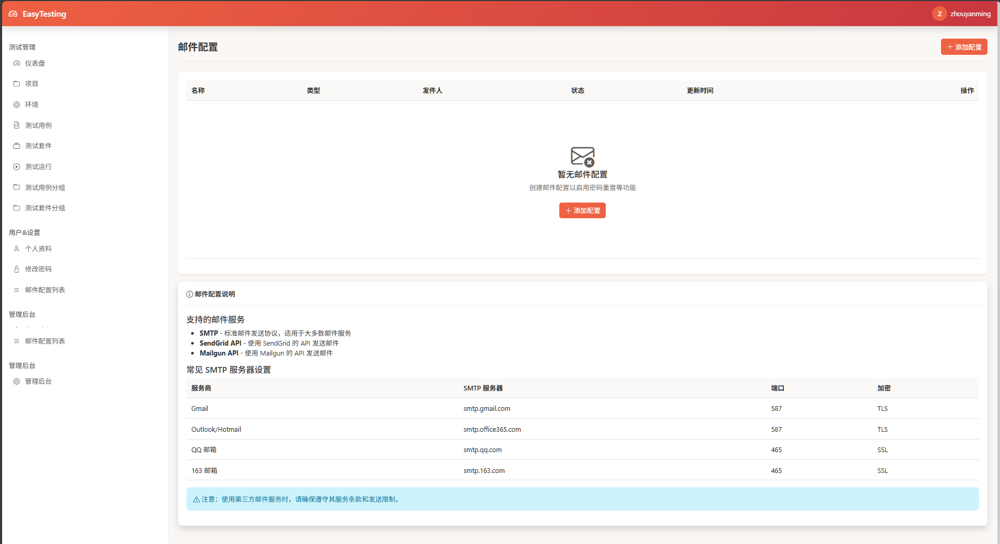

### 测试报告列表

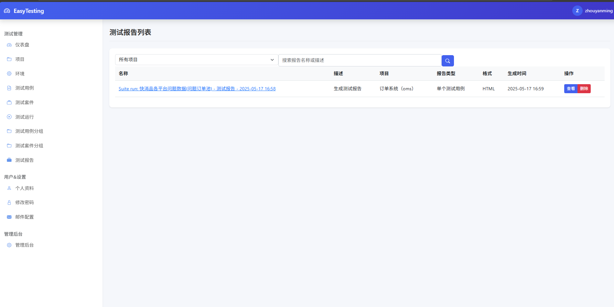

### 测试报告详情

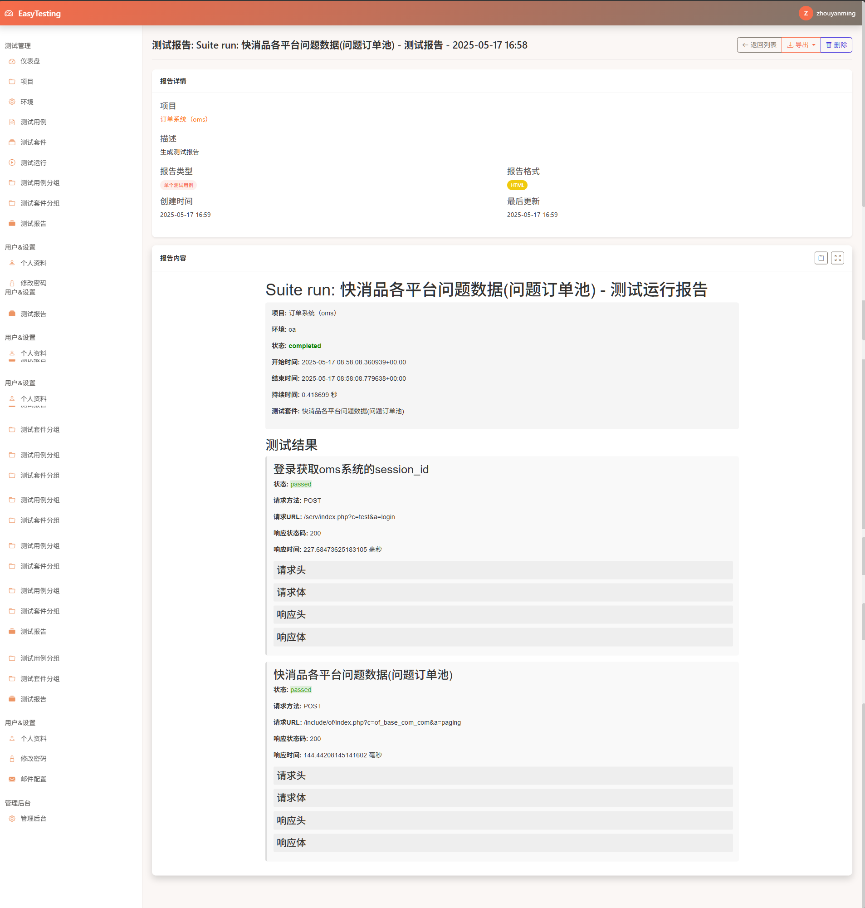

### 测试管理后台

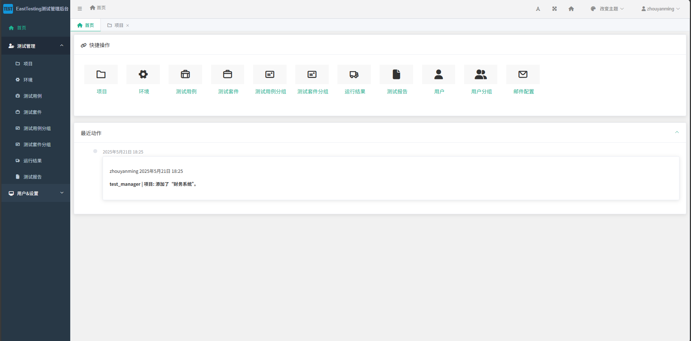

### 悬浮球
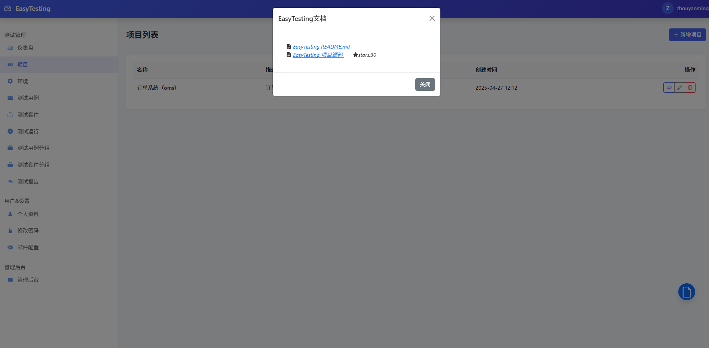

### mock数据
  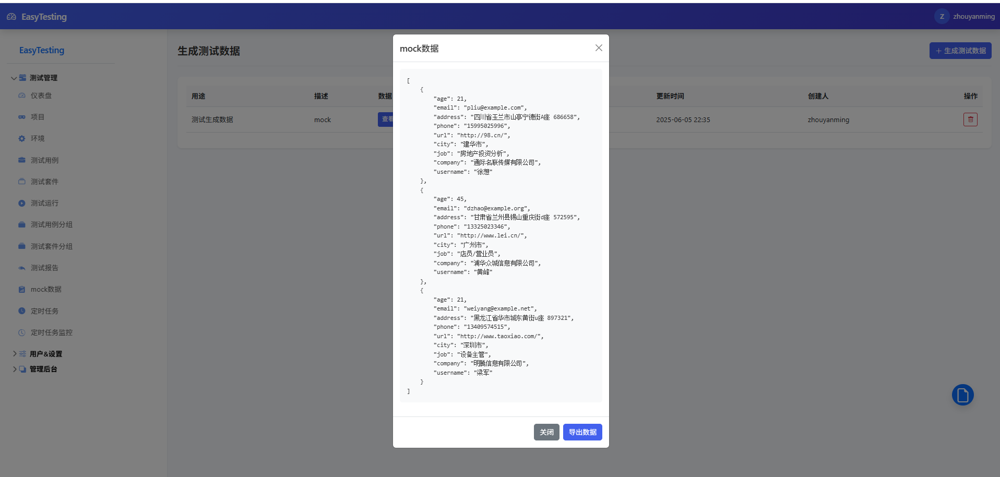

### 定时任务
   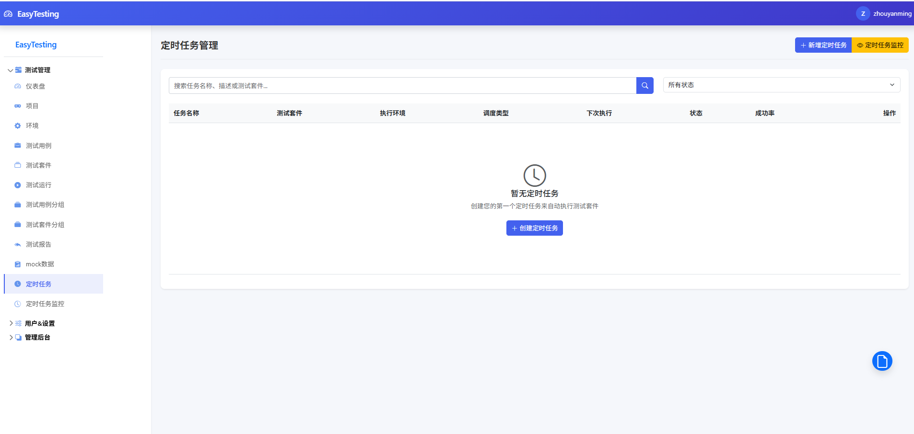

### 定时任务监控
   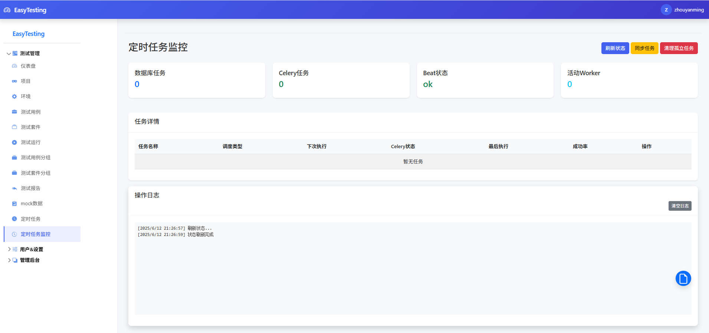

### 觉得项目不错，请作者喝一杯咖啡


### 交流群


-  二维码过期无法访问，请在主页添加个人微信，博主可拉进群，欢迎大家一起交流

## 贡献伙伴
   非常感谢以下小伙伴的贡献
- [jinpeng_zhang](https://gitee.com/jinpeng_zhang)

   

## License

本项目根据MIT许可证获得许可

## 致谢

- [Django](https://www.djangoproject.com/)
- [Django REST framework](https://www.django-rest-framework.org/)
- [SQLite](https://www.sqlite.org/index.html)
- [Bootstrap](https://getbootstrap.com/)
- [HTTPRunner](https://httprunner.com/)
- [Django-SimpleUI](https://github.com/xui2013/django-simpleui)